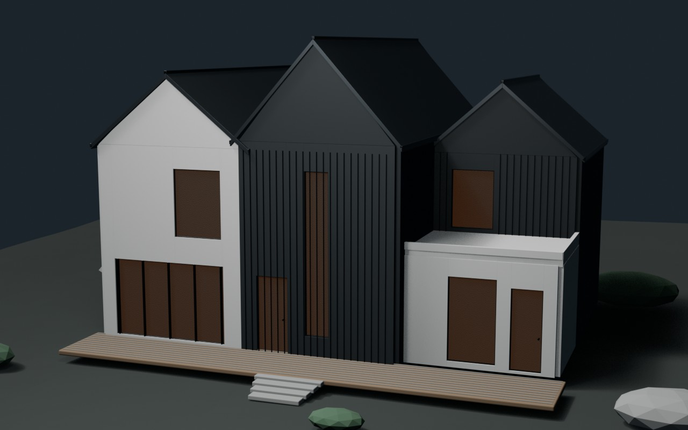

# KIN House — Concept BIM

Концептуальный BIM-проект частного дома, восстановленный по одному фасадному референсу. Архитектура собрана из трёх связанных двускатных объёмов и сочетает светлый бетон, обожжённое дерево, тёмный металл и тёплое остекление.

**[Открыть интерактивную 3D-презентацию](https://js-easy-school.github.io/kin-house-bim/)**

## Основные параметры

| Параметр | Значение |
|---|---:|
| Полезная площадь | 215 м² |
| Этажность | 2 этажа |
| Габарит пятна | 14,8 × 10,8 м |
| Высота конька | 9,8 м |
| Пространства в IFC | 21 |
| Стены / перекрытия / крыши | 41 / 4 / 3 |
| Стадия | Concept BIM · LOD 200 |

## Что есть в проекте

- IFC4-модель, проверенная валидатором IfcOpenShell: 0 ошибок.
- Редактируемые сцены Blender и Blender + Bonsai.
- Облегчённая GLB-модель для браузера.
- Интерактивные планы двух этажей, экспликация и фасадные виды.
- Исходные Python-сценарии генерации и подготовки модели.
- Адаптивная презентационная страница без сборки и зависимостей проекта.

## Файлы

| Путь | Назначение |
|---|---|
| `project/kin-house.ifc` | Открытая BIM-модель IFC4 |
| `project/kin-house-bonsai.blend` | Проект для Blender с дополнением Bonsai |
| `project/kin-house.blend` | Визуализационная сцена Blender |
| `project/kin-house.glb` | Облегчённая модель для веб-просмотра |
| `scripts/` | Сценарии воспроизводимой генерации |
| `PROJECT_STATUS.md` | Паспорт проекта, допущения и открытые вопросы |

## Инструменты

Blender 4.5.5 LTS · Bonsai 0.8.5 · IfcOpenShell 0.8.5 · IFC4 · HTML/CSS/JavaScript · `<model-viewer>`

## Важное ограничение

Это архитектурная концепция для портфолио и дальнейшей профессиональной разработки, а не рабочая документация. До строительства необходимы участок и топосъёмка, геология, расчёт конструкций и инженерных систем, проверка местных норм и выпуск документации лицензированными специалистами.
